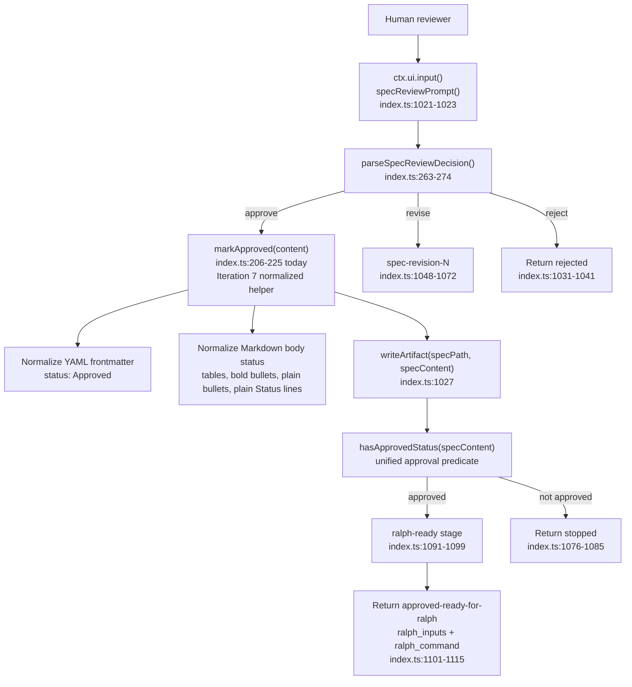

# atomic-workflows Spec Approval Status Synchronization Technical Design Document / RFC

| Document Metadata      | Details                     |
| ---------------------- | --------------------------- |
| Author(s)              | Norin Lavaee                |
| Status                 | In Review (RFC)             |
| Team / Owner           | Atomic workflow maintainers |
| Created / Last Updated | 2026-05-27 / 2026-05-27     |

## 1. Executive Summary

Iteration 7 is a focused correctness hardening pass for the `spec-driven-development` workflow’s human approval gate.

The previous RFC targeted `issue-test-lab` target-resolution parsing. Current repository inspection shows that issue is already resolved: `workflows/issue-test-lab/index.ts:72-73` now implements `parseTargetResolution()` by delegating to the tolerant `extractEnumLine()` helper. The remaining actionable review finding is reviewer-a’s P2: approved specs can still visibly contain body metadata such as `- **Status:** In Review` even after the workflow returns `status: "approved-ready-for-ralph"`.

The concrete defect is in `workflows/spec-driven-development/index.ts:206-225`. `markApproved()` updates YAML frontmatter and table-style status rows, but it does not update bullet-style or plain Markdown status lines when YAML frontmatter already contains `status: Approved`. The source spec demonstrates the contradiction today: `specs/2026-05-28-i-want-to-iterate-on-the.md:3` has `status: Approved`, while `specs/2026-05-28-i-want-to-iterate-on-the.md:12` still says `- **Status:** In Review`.

This RFC proposes a minimal internal fix: centralize spec approval status normalization so approval updates every recognized status surface before the Ralph handoff. No public workflow inputs, Ralph handoff metadata, `issue-test-lab` behavior, report/artifact helpers, or package discovery configuration need to change.

## 2. Context and Motivation

### 2.1 Current State

This repository is an Atomic workflow package discovered through `package.json:19-23`:

```json
"atomic": {
  "workflows": [
    "./workflows/*/index.ts"
  ]
}
```

The source product spec, `specs/2026-05-28-i-want-to-iterate-on-the.md`, defines the approved “High-Value PR/Branch Validation Workflow” for replacing `issue-test-lab` with a target-first merge-readiness workflow. Current implementation evidence shows that core work is already present:

- `workflows/issue-test-lab/index.ts:137-153` exposes `target`, `focus`, and deprecated `issue` inputs.
- `workflows/issue-test-lab/index.ts:72-73` already uses tolerant target-resolution parsing.
- `workflows/issue-test-lab/index.ts:277-402` runs stages B-F plus final recommendation when the target is resolved.
- `workflows/issue-test-lab/index.ts:453-464` returns compact metadata including `recommendation`, `targetSummary`, `riskLevel`, and `validationSummary`.
- `workflows/issue-test-lab/README.md` documents the target-first merge-readiness behavior.

The new defect is not inside `issue-test-lab`; it is in the upstream workflow that produces approved specs before handing implementation to Ralph:

- `workflows/spec-driven-development/index.ts:206-225` defines `markApproved()`.
- `workflows/spec-driven-development/index.ts:1025-1028` calls `markApproved()` when the reviewer replies with an approval alias.
- `workflows/spec-driven-development/index.ts:1075` gates Ralph readiness by checking only YAML `status: Approved` or table-style `| Status | Approved |`.
- `workflows/spec-driven-development/index.ts:1088-1115` returns Ralph launch metadata with `status: "approved-ready-for-ralph"`.
- `workflows/spec-driven-development/README.md:73-109` documents that approval marks the same spec file approved and returns Ralph metadata.

The workflow’s own spec-generation prompts require Markdown body metadata:

- `workflows/spec-driven-development/index.ts:1009` tells `create-spec` to include a metadata/status section.
- `workflows/spec-driven-development/index.ts:1065` tells revision tasks to keep Status as Draft/In Review until explicit approval.

The current source spec shows why the helper must handle body metadata, not just frontmatter:

```md
---
status: Approved
---

## Metadata / Status

- **Status:** In Review
```

Evidence: `specs/2026-05-28-i-want-to-iterate-on-the.md:1-12`.

### 2.2 The Problem

`markApproved()` treats frontmatter approval as sufficient and therefore skips updating visible body status lines. In the reviewer-a case, approval can produce a spec file that is machine-approved but human-visible as still in review.

This creates three concrete risks:

1. **Handoff ambiguity:** Ralph receives `Implement <approved-spec-path>`, but the opened spec can still visibly say `In Review`.
2. **Audit inconsistency:** A human reviewing the approved spec cannot trust the metadata/status section.
3. **Future false stops:** If a spec uses only bullet/plain Markdown status and no frontmatter/table status, updating the bullet to `Approved` is not enough unless the final approval predicate also recognizes that format.

Prior review findings addressed by this iteration:

- **reviewer-a P2 — “Update approved spec status everywhere”: accepted and in scope.** This RFC directly updates the approval helper design to normalize YAML frontmatter, Markdown tables, bold bullet status, plain bullet status, and plain body status lines before returning Ralph handoff metadata.
- **reviewer-b — no findings / patch correct:** no additional changes are required from reviewer-b’s review.
- The prior target-resolution parser RFC is now obsolete for current code because `parseTargetResolution()` already delegates to `extractEnumLine()` in `workflows/issue-test-lab/index.ts:72-73`.

## 3. Goals and Non-Goals

### 3.1 Functional Goals

1. Update `markApproved()` so approval normalizes all common status surfaces:
   - YAML frontmatter: `status: ...`
   - Markdown metadata table rows: `| Status | ... |`
   - bold bullet rows: `- **Status:** ...`
   - plain bullet rows: `- Status: ...`
   - plain body rows: `Status: ...`
2. Ensure body status updates happen even when YAML frontmatter already contains or is changed to `status: Approved`.
3. Add a shared approval predicate, for example `hasApprovedStatus(content)`, used after `markApproved()` before Ralph handoff.
4. Preserve current approval aliases and review-loop behavior in `parseSpecReviewDecision()`.
5. Preserve the Ralph handoff contract:
   - `status: "approved-ready-for-ralph"`
   - `approved_spec_path`
   - `ralph_workflow`
   - `ralph_inputs`
   - `ralph_command`
6. Correct the existing inconsistent generated source spec at `specs/2026-05-28-i-want-to-iterate-on-the.md` so its body metadata also says `Approved`.
7. Keep `markApproved()` idempotent: running it repeatedly should not duplicate status lines.
8. Validate the exact reviewer-a scenario with deterministic checks.

### 3.2 Non-Goals (Out of Scope)

1. No changes to `issue-test-lab` public behavior or recommendation semantics.
2. No changes to the `ralph` workflow or automatic Ralph execution.
3. No changes to workflow discovery in `package.json`.
4. No broad Markdown parser dependency such as `remark`.
5. No redesign of spec templates or the RFC template.
6. No changes to approval/rejection alias vocabulary.
7. No changes to research artifact generation, artifact manifests, or report output helpers.
8. No migration of historical research documents or brainstorm files beyond correcting the currently inconsistent approved source spec.

## 4. Proposed Solution (High-Level Design)

Replace the current “frontmatter-or-table-only” approval logic with centralized status normalization.

The new implementation should conceptually split a spec into:

1. optional YAML frontmatter;
2. Markdown body.

Then it should:

1. update or add frontmatter `status: Approved` using the existing behavior;
2. independently scan the Markdown body for recognized status lines and replace their values with `Approved`;
3. preserve current fallback insertion only when no status surface exists at all;
4. use a unified `hasApprovedStatus()` predicate for the post-loop handoff gate.

This keeps the change small and localized to `workflows/spec-driven-development/index.ts`, while directly addressing the reviewer-a finding.

### 4.1 System Architecture Diagram



### 4.2 Architectural Pattern

The selected pattern is **centralized metadata normalization with a single approval predicate**.

Today, approval mutation and approval detection are separate, partially overlapping regex checks. Iteration 7 should introduce a single internal model of “approved status surfaces” so mutation and detection cannot drift.

This follows existing repository patterns:

- `workflows/issue-test-lab/index.ts:46-59` centralizes enum metadata parsing with `extractEnumLine()`.
- `workflows/security-gate/index.ts:24-32` centralizes final decision parsing with a normalized fallback.
- `rfc-context/patterns.md` identifies normalized decision parsing and fallback behavior as an established workflow convention.

The proposed design remains intentionally lightweight: targeted regular expressions are sufficient for the small status formats generated by this workflow, and a full Markdown AST would be unnecessary scope.

### 4.3 Key Components

| Component | Responsibility | Technology Stack | Justification |
| --------- | -------------- | ---------------- | ------------- |
| `workflows/spec-driven-development/index.ts::markApproved()` | Mutate approved spec Markdown so all recognized status surfaces say `Approved`. | TypeScript, RegExp | Direct defect location from reviewer-a; currently misses bullet/plain Markdown body status. |
| New `hasApprovedStatus(content)` helper | Decide whether the spec is approved before Ralph handoff. | TypeScript, RegExp | Prevents mutation/detection drift and lets bullet/plain-only specs pass after approval. |
| New body-status normalization helper | Update table, bold bullet, plain bullet, and plain body `Status:` lines outside frontmatter. | TypeScript, RegExp | Solves the visible contradiction in generated specs without changing public APIs. |
| Existing review loop | Calls approval/revision/rejection logic and writes the same spec path. | Atomic workflow runtime, TypeScript | Existing control flow at `index.ts:1019-1075` should remain intact. |
| Existing Ralph handoff | Returns launch metadata after approval. | Atomic workflow runtime | Contract documented in `workflows/spec-driven-development/README.md:87-121`; no API change needed. |
| `specs/2026-05-28-i-want-to-iterate-on-the.md` | Existing approved generated spec with inconsistent body status. | Markdown | Concrete migration target demonstrating the defect. |

## 5. Detailed Design

### 5.1 API Interfaces

No public workflow API changes.

The `spec-driven-development` inputs remain:

```ts
.input("mode", ...)
.input("prompt", ...)
.input("max_loops", ...)
```

The return contract remains unchanged for approved specs:

```ts
{
  status: "approved-ready-for-ralph",
  approved_spec_path: specPath,
  ralph_workflow: "ralph",
  ralph_inputs: {
    prompt: `Implement ${specPath}`,
    max_loops: maxLoops
  },
  ralph_command: ...
}
```

Internal helper contracts should become:

```ts
function markApproved(content: string): string
function hasApprovedStatus(content: string): boolean
```

Recognized status forms:

| Status surface | Example before | Example after |
| --- | --- | --- |
| YAML frontmatter | `status: In Review` | `status: Approved` |
| Markdown table | `| Status | In Review (RFC) |` | `| Status | Approved |` |
| Bold bullet | `- **Status:** In Review` | `- **Status:** Approved` |
| Plain bullet | `- Status: Draft` | `- Status: Approved` |
| Plain body line | `Status: Draft` | `Status: Approved` |

### 5.2 Data Model / Schema

There is no durable schema change. Specs remain Markdown files.

The internal status model should be:

```ts
type SpecApprovalStatus = "Approved";
```

The implementation does not need to model every possible pre-approval value. It only needs to detect lines whose label is `Status` and replace the value with `Approved`.

Important parsing constraints:

1. YAML frontmatter should be handled only inside the initial `--- ... ---` block.
2. Body `Status:` line replacement should run only outside frontmatter to avoid double-processing YAML.
3. Replacement should be case-insensitive for the label, but should emit canonical `Approved`.
4. The helper should not update unrelated text such as “approval status” inside prose.
5. If no status surface exists, preserve current fallback behavior by inserting `Status: Approved` after the first H1 heading, or at the top if no H1 exists.

### 5.3 Algorithms and State Management

Proposed approval algorithm:

1. Split `content` into `{ frontmatter, body }` if it starts with YAML frontmatter.
2. In frontmatter:
   - if a `status:` line exists, replace it with `status: Approved`;
   - otherwise append `status: Approved`.
3. In body, independently update all recognized status rows:
   - table row matching a `Status` first cell;
   - bold bullet `- **Status:** ...` or `* **Status:** ...`;
   - plain bullet `- Status: ...` or `* Status: ...`;
   - plain `Status: ...` line.
4. Track whether any status surface was found in frontmatter or body.
5. If no status surface was found, insert `Status: Approved` after the first H1 heading or prepend it.
6. Reassemble frontmatter and body.
7. Use `hasApprovedStatus()` after the review loop to check the same recognized forms.

State management remains unchanged:

- The workflow still rewrites the same `specPath`.
- The approval loop still stops only on explicit approval.
- Ralph is still not launched by `spec-driven-development`; the workflow returns metadata for the parent chat/agent to launch Ralph separately.

## 6. Alternatives Considered

| Option | Pros | Cons | Reason for Rejection |
| ------ | ---- | ---- | -------------------- |
| Centralize approval status normalization across frontmatter, tables, bullets, and plain body lines | Directly fixes reviewer-a P2; small localized change; preserves public API; supports specs generated by the workflow’s own prompts. | Requires careful regex boundaries to avoid frontmatter/body double-processing. | Selected because it solves the observed defect with minimal scope. |
| Only update the existing inconsistent spec file | Fastest visible cleanup for `specs/2026-05-28-i-want-to-iterate-on-the.md`. | Leaves the workflow bug in place for future approved specs. | Rejected because reviewer-a identified a workflow defect, not just a stale artifact. |
| Only change `create-spec` and revision prompts to avoid body status metadata | Reduces chance of future duplicated status fields. | Does not fix already-generated specs; LLM output may still include body metadata; does not make approval robust. | Rejected because runtime approval must be resilient to common Markdown forms. |
| Add a full Markdown/YAML parser dependency | More structured parsing and fewer regex edge cases. | Adds dependency and complexity for a narrow metadata rewrite; this package currently has no runtime dependencies beyond Atomic peer workflow integration. | Rejected as over-engineered for this iteration. |
| Leave `markApproved()` unchanged and rely on frontmatter as the source of truth | No implementation work. | Preserves visible contradiction and fails reviewer-a’s P2. | Rejected because approved specs must be unambiguous to humans and Ralph handoff consumers. |

## 7. Cross-Cutting Concerns

### 7.1 Security and Privacy

This change does not add network access, shell execution, credentials, external API calls, or new file write locations.

The workflow already writes the approved spec file through `writeArtifact(specPath, specContent)` at `workflows/spec-driven-development/index.ts:1027`. Iteration 7 only changes the Markdown content written to that same path.

Security benefit: Ralph handoff consumers will no longer be asked to implement a spec that visibly says it is still in review.

### 7.2 Observability Strategy

Observability remains file-based and workflow-result-based:

- The approved spec file at `approved_spec_path` should visibly show `Approved` in all status metadata.
- The workflow still returns `status: "approved-ready-for-ralph"`.
- The `ralph-ready` stage text remains the human-visible checkpoint before implementation handoff.

The most important observable success criterion is that `specs/2026-05-28-i-want-to-iterate-on-the.md` no longer has contradictory status metadata after the cleanup.

### 7.3 Scalability and Capacity Planning

No meaningful scalability impact.

The helper performs a small number of regular-expression passes over one Markdown spec file. Spec files are small relative to workflow research artifacts and LLM task outputs. The change does not affect parallelism, artifact directory creation, report writing, or Ralph execution.

## 8. Migration, Rollout, and Testing

### 8.1 Deployment Strategy

1. Update `workflows/spec-driven-development/index.ts` with centralized status normalization and approval detection.
2. Replace the post-loop approval gate at `workflows/spec-driven-development/index.ts:1075` with the unified `hasApprovedStatus()` helper.
3. Correct `specs/2026-05-28-i-want-to-iterate-on-the.md` so the body metadata line `- **Status:** In Review` becomes `- **Status:** Approved`.
4. Do not change `issue-test-lab`, Ralph, workflow inputs, or package discovery.
5. Run repository validation:
   - `git diff --check`
   - `bun build workflows/spec-driven-development/index.ts --external @bastani/workflows --outdir /tmp/atomic-workflows-build-spec-status`
   - `npm pack --dry-run`

### 8.2 Data Migration Plan

No runtime data migration is required.

One repository cleanup is required for the current generated source spec:

- Update `specs/2026-05-28-i-want-to-iterate-on-the.md:12` from `- **Status:** In Review` to `- **Status:** Approved`.

Historical research artifacts, brainstorms, and prior RFCs should not be rewritten.

### 8.3 Test Plan

Use a red/green approach around the pure approval-status behavior before changing implementation.

Required deterministic cases:

| Case | Expected result |
| --- | --- |
| YAML only: `status: In Review` | frontmatter becomes `status: Approved`; approved predicate true |
| YAML approved plus bold body bullet `- **Status:** In Review` | both surfaces say `Approved`; approved predicate true |
| Table row `| Status | In Review (RFC) |` | row becomes `| Status | Approved |`; approved predicate true |
| Bold bullet only `- **Status:** Draft` | bullet becomes `- **Status:** Approved`; approved predicate true |
| Plain bullet only `- Status: Draft` | bullet becomes `- Status: Approved`; approved predicate true |
| Plain body only `Status: Draft` | line becomes `Status: Approved`; approved predicate true |
| No status line, has H1 | inserts `Status: Approved` after H1; approved predicate true |
| Running `markApproved()` twice | no duplicate status lines; content remains stable |
| Rejection/revision review replies | unchanged behavior |

Reviewer-finding regression check:

1. Use the exact structure from `specs/2026-05-28-i-want-to-iterate-on-the.md:1-12`.
2. Run `markApproved()`.
3. Assert no line still contains `Status:** In Review`, `Status: In Review`, or table `In Review` status.
4. Assert the post-loop approval predicate returns true.

Manual validation:

- Inspect the final approved spec and confirm all visible status metadata says `Approved`.
- Confirm `workflows/spec-driven-development/README.md` remains accurate: approval marks the same spec file approved and returns Ralph metadata.

## 9. Open Questions / Unresolved Issues

1. Should `markApproved()` and `hasApprovedStatus()` be exported for direct unit testing, or should they remain private with ad hoc validation only? `[OWNER: Atomic workflow maintainers]`

2. Should future spec-generation prompts avoid duplicating status in both YAML frontmatter and Markdown body metadata, or is dual metadata useful for human readability? `[OWNER: workflow UX owner]`

3. Should `spec-driven-development` record the approval timestamp or reviewer identity in approved specs, or keep approval status as the only mutation for now? `[OWNER: product/workflow owner]`
